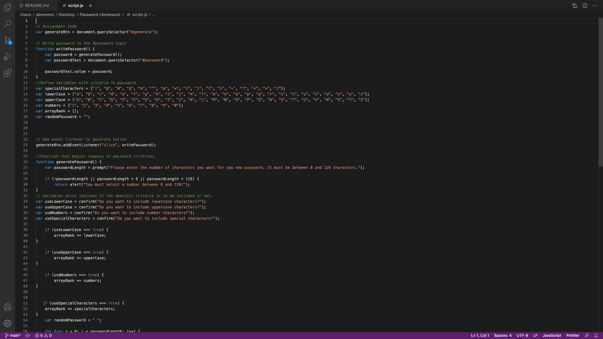

# Project Generator

## Description

This application will generate a password on your browser after the user provides required criteria. 

## Installation

No installation is needed other than prefered browers and a keyboard to enter criteria.

- Open the browser to the following link:     https://al-moreno.github.io/Password-Homework/  
- Enter requested critira and press generate password button
- Password will display on screen.

## Usage

This applicaitons usage would be benefitial when attempting to provide a ramdome password for employees, students or any individuals requirieng such an item.

Alternativly you may open my code for review with VSCode.

 https://al-moreno.github.io/Password-Homework/

*linsk 

## This repo contains:

- A ReadMe.md file
- A javascript powered password generator pages which will display a randome password once user enters required critiria

## License
Uncertain of required licence so to CMA I am leaving the one pertaining to Trilogy Education Services.

---

© 2021 Trilogy Education Services, LLC, a 2U, Inc. brand. Confidential and Proprietary. All Rights Reserved.
